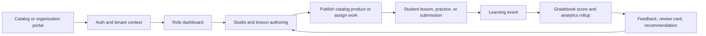

# EdSync Data Schema And Learning Flow Audit

**Updated:** 2026-05-18

## Scope

This audit maps the actual D1 schema, shared serializers, service helpers, and API routes that shape EdSync's learning data architecture. It covers courses, modules, lessons, Studio documents, catalog products, enrollments, progress, assessments, grades, media, tenants, permissions, and AI/admin operations.

## Verification Method

- Read all D1 migrations in `database/migrations`.
- Checked the shared table and JSON serializer registry in `src/lib/db/schema.ts`.
- Verified key write/read flows in `src/app/api/*`, especially Studio, work, submissions, grades, catalog, billing, tenancy, standards, offline sync, practice, and generic data access.
- Checked page-level client data access through `edsync.from(...)` to identify legacy surfaces that still read or write broad tables.
- Compared schema ownership against current tenant helpers in `src/lib/tenancy.ts`, D1 REST access in `src/lib/db/d1.ts`, and event append helpers in `src/lib/learning-events.ts`.

## Current Architecture Summary

EdSync is a Cloudflare-first modular monolith backed by D1. The data model is additive and layered:

1. Core auth, profiles, classes, lessons, assignments, progress, quiz attempts, AI runs, storage, and automation jobs.
2. Engagement and media: notifications, email outbox, media assets, extraction records, announcements, and schedules.
3. Security: rate limits and security events.
4. Admin and learning operations: admin users, feature flags, AI providers, gradebook, work items, discussions, notes, and teacher email outbox.
5. Universal LMS layer: tenants, portals, memberships, domains, permissions, learning events, content blocks, standards packages, certifications, automation rules, achievements, billing, entitlements, offline sync, and analytics rollups.
6. Studio and Practice layer: studio documents/assets, practice attempts/items, and review cards.

The best current spine is:



## Relational Schema By Domain

### Identity And Auth

| Table | Purpose | Key relationships | JSON fields |
| --- | --- | --- | --- |
| `auth_users` | Login identity and password hash. | Root identity for `profiles`, `auth_sessions`, `auth_tokens`. | None |
| `auth_sessions` | Opaque session token hashes. | `user_id -> auth_users.id`; role currently checked as teacher/student in migration, while app types now allow admin through `admin_users`. | None |
| `auth_tokens` | Verification, invite, or password-style token hashes. | `user_id -> auth_users.id`. | None |
| `profiles` | User profile, role, preferences, gamification counters. | `id -> auth_users.id`; referenced by most actor/student/teacher fields. | `subjects`, `interests`, `preferences`, `achievements` |
| `admin_users` | Global platform-owner admin grant. | `user_id -> profiles.id`; separate from tenant admin roles. | None |

Notes:
- The app type `UserRole = "admin" | "teacher" | "student"` is newer than the migration-level checks on `auth_sessions.role` and `profiles.role`.
- Global admin and tenant/org admin are conceptually different. The schema supports this through `admin_users` for platform admins and `tenant_memberships`/`role_profiles` for scoped tenant admins.

### Tenants, Portals, Permissions, And Organization Routing

| Table | Purpose | Key relationships | JSON fields |
| --- | --- | --- | --- |
| `tenants` | Organization or academy container. | `owner_id -> profiles.id`. | `settings` |
| `tenant_portals` | Public/internal/customer/partner portal for a tenant. | `tenant_id -> tenants.id`. | `theme`, `catalog_settings` |
| `tenant_memberships` | User membership inside one tenant. | `tenant_id -> tenants.id`, `user_id -> profiles.id`, `role_profile_id` currently text without FK. | `permissions` |
| `tenant_domains` | Custom host routing to tenant/portal. | `tenant_id -> tenants.id`, `portal_id -> tenant_portals.id`. | None |
| `tenant_runtime_bindings` | Optional tenant-specific D1/R2/Queue/Vectorize resource references. | `tenant_id -> tenants.id`. | `settings` |
| `tenant_object_links` | Tenant/portal ownership overlay for legacy and shared tables. | `tenant_id -> tenants.id`, optional `portal_id -> tenant_portals.id`; `object_table` + `object_id` points to any content/object table. | None |
| `permission_catalog` | System permission keys. | None. | None |
| `role_profiles` | Bundled permission profiles for tenant roles. | Optional `tenant_id -> tenants.id`. | `permissions` |

Current source of truth:
- `resolveTenantContext()` resolves by active custom domain or default tenant.
- If a logged-in user has no membership, it auto-creates one based on session role.
- `linkTenantObject()` records tenant ownership for newer objects.

Main risk:
- Auto-created memberships are good for bootstrapping but weaker for Blackboard-style organization routing. A mature organization flow should store an explicit active tenant/portal selection in the session or a signed tenant-context cookie and audit membership creation.

### Classes, Enrollment, Lessons, And Assignments

| Table | Purpose | Key relationships | JSON fields |
| --- | --- | --- | --- |
| `classes` | Teacher-owned class/cohort. | `teacher_id -> profiles.id`. | `settings` |
| `class_enrollments` | Student membership in a class. | `class_id -> classes.id`, `student_id -> profiles.id`; unique class/student. | None |
| `lessons` | Legacy/current course lesson package. | `teacher_id -> profiles.id`, optional `class_id -> classes.id`. | `objectives`, `tags`, `prerequisites`, `personalization` |
| `lesson_sections` | Ordered lesson content blocks. | `lesson_id -> lessons.id`. | `metadata` |
| `quiz_questions` | Lesson-attached quiz/check questions. | `lesson_id -> lessons.id`, optional `section_id -> lesson_sections.id`. | `options` |
| `lesson_assignments` | Lesson assigned to class or student. | `lesson_id -> lessons.id`, optional `class_id -> classes.id`, optional `student_id -> profiles.id`, `assigned_by -> profiles.id`. | None |
| `glossary_terms` | Lesson vocabulary. | `lesson_id -> lessons.id`. | None |
| `course_versions` | Snapshots of lesson state. | `tenant_id -> tenants.id`, `lesson_id -> lessons.id`, `created_by -> profiles.id`. | `snapshot` |

Current behavior:
- Teacher lesson pages still write directly through the generic EdSync client for `lessons`, `lesson_sections`, `quiz_questions`, `glossary_terms`, and `lesson_assignments`.
- Shared adapters in `src/lib/learning/objects.ts` and `src/lib/learning/lesson-package.ts` normalize legacy lessons, sections, quiz questions, and content blocks into a package-style `LearningObject`.

Needed maturity step:
- Studio should become the canonical authoring source, with lessons consuming Studio/content-block records rather than maintaining a parallel page-owned editor model.

### Studio, Content Blocks, Imports, And Standards

| Table | Purpose | Key relationships | JSON fields |
| --- | --- | --- | --- |
| `studio_documents` | Native notes, docs, sheets, slides, practice, imports, designs. | `tenant_id -> tenants.id`, `owner_id -> profiles.id`; optional `source_type/source_id`. | `content`, `metadata` |
| `studio_assets` | Media/assets attached to Studio documents. | `tenant_id -> tenants.id`, `owner_id -> profiles.id`, `document_id -> studio_documents.id`, `media_asset_id -> media_assets.id`. | `metadata` |
| `content_blocks` | Reusable tenant-scoped learning blocks. | `tenant_id -> tenants.id`, `owner_id -> profiles.id`. | `data`, `tags` |
| `standards_packages` | SCORM/xAPI/cmi5 package metadata. | `tenant_id -> tenants.id`, `owner_id -> profiles.id`, `storage_object_id -> storage_objects.id`. | `manifest` |
| `standards_launches` | Per-user launch/progress for standards packages. | `tenant_id -> tenants.id`, `package_id -> standards_packages.id`, `user_id -> profiles.id`, optional `lesson_id -> lessons.id`. | `runtime_data` |
| `xapi_statements` | Stored xAPI statements. | `tenant_id -> tenants.id`, `actor_id -> profiles.id`, optional `package_id -> standards_packages.id`. | `statement` |
| `content_extractions` | Text extraction from uploaded content. | `user_id -> profiles.id`. | `metadata` |

Current behavior:
- `/api/studio` is tenant-scoped and owner/admin-safe.
- `/api/content-blocks` is tenant-scoped and records learning events.
- Standards endpoints are tenant-scoped and update `tenant_object_links`.
- Studio drafts have good local-first concepts, but lesson creation still has duplicated state and direct writes.

### Work, Assessments, Grades, Progress, And Practice

| Table | Purpose | Key relationships | JSON fields |
| --- | --- | --- | --- |
| `student_progress` | Materialized lesson progress per student/lesson. | `student_id -> profiles.id`, `lesson_id -> lessons.id`; unique student/lesson. | `sections_completed`, `knowledge_gaps`, `metadata` |
| `quiz_attempts` | Legacy per-question lesson quiz attempts. | `student_id -> profiles.id`, `lesson_id -> lessons.id`, `question_id -> quiz_questions.id`. | None |
| `learning_work_items` | Unified quiz/test/task/discussion/activity. | `teacher_id -> profiles.id`, optional `class_id -> classes.id`, optional `lesson_id -> lessons.id`, optional `category_id -> gradebook_categories.id`. | `rubric`, `settings` |
| `learning_work_questions` | Questions/prompts for work items. | `work_item_id -> learning_work_items.id`. | `options`, `metadata` |
| `learning_submissions` | Student response to a work item. | `work_item_id -> learning_work_items.id`, `student_id -> profiles.id`, optional `class_id -> classes.id`, optional `attachment_storage_id -> storage_objects.id`. | `response` |
| `gradebook_categories` | Weighted grade categories by class. | `class_id -> classes.id`, `teacher_id -> profiles.id`. | None |
| `gradebook_scores` | Materialized grade rows. | `student_id -> profiles.id`, `teacher_id -> profiles.id`, optional `class_id -> classes.id`, optional `category_id -> gradebook_categories.id`; unique student/source. | `metadata` |
| `learning_events` | Append-only event stream for learning, Studio, work, grades, offline sync, AI workflow. | `tenant_id -> tenants.id`, optional `actor_id/student_id -> profiles.id`, optional `class_id -> classes.id`. | `payload` |
| `gradebook_replay_runs` | Replay/audit runs for gradebook rebuilds. | `tenant_id -> tenants.id`, `requested_by -> profiles.id`. | `result` |
| `practice_attempts` | Unified practice run summary. | `tenant_id -> tenants.id`, `user_id -> profiles.id`. | `summary` |
| `practice_attempt_items` | Per-item answer detail for a practice attempt. | `attempt_id -> practice_attempts.id`. | `metadata` |
| `practice_review_cards` | Missed-item review queue. | `tenant_id -> tenants.id`, `user_id -> profiles.id`, optional `attempt_item_id -> practice_attempt_items.id`. | `metadata` |

Current behavior:
- `/api/work` creates work items, questions, discussion thread seeds, tenant object links, and learning events.
- `/api/work/submissions` records submissions and teacher grading through `recordGradeEvent()`.
- `/api/grades` computes weighted averages from `gradebook_scores` and writes grade events.
- `/api/practice/attempts` records attempts, items, review cards, and a practice completion event.

Important gap:
- `learning_events` exists but gradebook is not fully event-derived yet. `recordGradeEvent()` writes the event and immediately upserts `gradebook_scores`; replay is designed but not implemented as the main grade derivation path.

### Engagement, Planning, Notes, And Communications

| Table | Purpose | Key relationships | JSON fields |
| --- | --- | --- | --- |
| `notifications` | In-app notification records. | `user_id -> profiles.id`, optional `actor_id -> profiles.id`. | `channels`, `metadata` |
| `email_messages` | System email queue/provider record. | Optional `recipient_user_id -> profiles.id`. | `metadata` |
| `email_outbox_events` | Free/manual teacher compose outbox. | Optional `teacher_id -> profiles.id`, optional `class_id -> classes.id`. | `recipients`, `metadata` |
| `announcements` | Teacher announcement for class/all audience. | `teacher_id -> profiles.id`, optional `class_id -> classes.id`. | `metadata` |
| `schedule_events` | Deadline/class/office/study/announcement calendar item. | `owner_id -> profiles.id`, optional `class_id -> classes.id`, optional `lesson_id -> lessons.id`. | `metadata` |
| `discussion_threads` | Class/work discussion thread. | Optional `work_item_id -> learning_work_items.id`, optional `class_id -> classes.id`, `teacher_id -> profiles.id`. | None |
| `discussion_posts` | Thread posts and replies. | `thread_id -> discussion_threads.id`, `author_id -> profiles.id`, optional `parent_id -> discussion_posts.id`. | `metadata` |
| `student_notes` | Teacher notes for a student. | `teacher_id -> profiles.id`, `student_id -> profiles.id`, optional `class_id -> classes.id`. | `metadata` |
| `teacher_alerts` | Teacher intervention/achievement alerts. | `teacher_id -> profiles.id`, optional `student_id -> profiles.id`, optional `lesson_id -> lessons.id`. | `metadata` |

Current behavior:
- Dedicated APIs exist for notifications, planner, discussions, notes, and email.
- Some class/student relationships are still checked by role/ownership rather than tenant object links.

### Media, Storage, Security, AI, Automation, Analytics, And Billing

| Table | Purpose | Key relationships | JSON fields |
| --- | --- | --- | --- |
| `storage_objects` | R2 object metadata. | Optional `owner_id -> profiles.id`; unique bucket/key. | `metadata` |
| `media_assets` | Higher-level media record for images/video/audio/docs. | Optional `owner_id -> profiles.id`, optional `storage_object_id -> storage_objects.id`. | `metadata` |
| `rate_limits` | Request throttling counters. | None. | None |
| `security_events` | Security/audit events. | Optional `user_id -> profiles.id`. | `metadata` |
| `ai_provider_configs` | Admin-managed encrypted provider settings. | `created_by -> profiles.id`. | `supported_models` |
| `ai_runs` | AI request/response audit. | Optional `user_id -> profiles.id`. | `request`, `response`, `metadata` |
| `automation_jobs` | Worker/queue job records. | None. | `payload`, `result` |
| `automation_rules` | Tenant-scoped automation recipes. | `tenant_id -> tenants.id`, `created_by -> profiles.id`. | `conditions`, `actions` |
| `certification_rules` | Compliance/certification renewal rules. | `tenant_id -> tenants.id`, optional `course_id -> lessons.id`. | `settings` |
| `learner_certifications` | User certification state. | `tenant_id -> tenants.id`, `rule_id -> certification_rules.id`, `user_id -> profiles.id`. | `evidence` |
| `achievements_catalog` | Tenant badge/points definitions. | `tenant_id -> tenants.id`. | `criteria` |
| `user_achievements` | Earned badges. | `tenant_id -> tenants.id`, `user_id -> profiles.id`, `achievement_id -> achievements_catalog.id`, optional `awarded_by_event_id -> learning_events.id`. | None |
| `analytics_rollups` | Precomputed reporting metrics. | `tenant_id -> tenants.id`; scoped by `scope_type/scope_id`. | `metrics` |
| `billing_customers` | Payment customer identity. | `tenant_id -> tenants.id`, optional `user_id -> profiles.id`. | `metadata` |
| `billing_products` | Catalog/billing products. | `tenant_id -> tenants.id`, optional `course_id -> lessons.id`. | `metadata` |
| `billing_prices` | Prices for products. | `tenant_id -> tenants.id`, `product_id -> billing_products.id`. | None |
| `billing_bundles` | Product-to-product bundles. | `tenant_id -> tenants.id`, `bundle_product_id -> billing_products.id`, `child_product_id -> billing_products.id`. | None |
| `billing_subscriptions` | Subscription state. | `tenant_id -> tenants.id`, optional `customer_id -> billing_customers.id`, optional `price_id -> billing_prices.id`. | None |
| `billing_invoices` | Invoice records. | `tenant_id -> tenants.id`, optional `customer_id -> billing_customers.id`. | None |
| `billing_transactions` | Payment transaction records. | `tenant_id -> tenants.id`, optional customer/product/price links. | `metadata` |
| `entitlements` | Course/product access grant. | `tenant_id -> tenants.id`, `user_id -> profiles.id`, optional `product_id -> billing_products.id`. | `metadata` |
| `billing_coupons` | Coupons. | `tenant_id -> tenants.id`. | `metadata` |
| `billing_webhook_events` | Provider webhook idempotency/audit. | Optional `tenant_id -> tenants.id`. | `payload` |
| `offline_sync_items` | Local offline action queue. | `tenant_id -> tenants.id`, `user_id -> profiles.id`, optional `server_event_id -> learning_events.id`. | `payload` |

Current behavior:
- Catalog uses `billing_products`, `billing_prices`, `tenant_portals`, `tenant_object_links`, and `entitlements`.
- Media validation exists for safe catalog media and uploads.
- AI provider configs are encrypted and admin-managed, with AI attempts audited.
- D1 access uses Cloudflare REST from `src/lib/db/d1.ts` in all runtimes.

## Data Flow Findings

### What Is Good

- The schema already separates global platform admin (`admin_users`) from tenant-scoped roles (`tenant_memberships`, `role_profiles`).
- Newer APIs consistently resolve tenant context and constrain writes by `tenant_id`.
- `tenant_object_links` lets legacy tables be progressively mapped into tenant/portal ownership without destructive migrations.
- Studio, content blocks, work items, standards, catalog/billing, practice attempts, automation, and certifications are additive and tenant-scoped.
- `learning_events` provides the right foundation for replayable grading, automation, analytics, achievements, and offline sync.
- `src/lib/db/schema.ts` gives a central table registry and JSON serialization map, which reduces ad hoc JSON handling.

### Weak Spots

- Legacy page-owned data access remains broad. Teacher and student pages still use `edsync.from(...)` for `lessons`, `lesson_sections`, `quiz_questions`, `student_progress`, `lesson_assignments`, `classes`, and `profiles`.
- Generic `/api/data` is safer than before because it blocks server-only tables and some writes, but allowed-table reads can still be broad unless each caller adds correct filters.
- Tenant context is mostly resolved by host/default tenant and can auto-create memberships. That is not explicit enough for organization-first login/SSO and audited org switching.
- `auth_sessions.role` and `profiles.role` migration checks do not include `admin`, while app types and runtime logic do. This can become a migration drift issue.
- `learning_events` is append-only, but gradebook materialization is still synchronous upsert logic, not replay-first.
- New tenant-scoped tables and older lesson/progress tables coexist without a full ownership guarantee unless `tenant_object_links` is populated and checked everywhere.
- D1 access is REST-only. On Cloudflare Workers/Pages, native D1 bindings should be preferred to reduce latency and remove API-token dependency from runtime queries.
- PWA/offline stores events, but full offline lesson/practice replay is not yet mature enough to be trusted for high-stakes submissions.

## Recommended Schema And Flow Improvements

### 1. Make Tenant Context Explicit

Add a signed active tenant context to the auth/session layer:

- `active_tenant_id`
- `active_portal_id`
- `membership_id`
- `tenant_context_source = domain | org_code | user_switch | default`

Do not silently auto-create memberships except during signup, invite acceptance, or explicit organization join. Log those events to `admin_audit_logs` or `learning_events`.

### 2. Replace Generic Reads With Feature APIs

Move legacy page data access behind feature-owned APIs:

- `GET /api/lessons/:id/package`
- `POST /api/lessons/:id/sections`
- `POST /api/lessons/:id/quiz-questions`
- `POST /api/lessons/:id/assign`
- `POST /api/student-progress`
- `GET /api/student/dashboard`
- `GET /api/teacher/dashboard`

Each API should enforce:

- session identity
- active tenant membership
- object tenant link
- class enrollment or teacher ownership
- role/permission bundle

### 3. Normalize Content Management Around Studio

Keep `lessons` as the publishable learning package, but move authoring source of truth toward:

- `studio_documents` for draft documents, slides, sheets, imports, practice sets
- `content_blocks` for reusable lesson sections
- `course_versions` for immutable snapshots
- `lesson_sections` as published render blocks or compatibility output

This removes duplicated editors and lets lesson creation, AI import, slides, and practice all share one object model.

### 4. Make Gradebook Fully Event-Derived

Keep `gradebook_scores` as a materialized view, but make it rebuildable from:

- `learning_events.event_type = work.submitted`
- `grade.lesson_quiz.recorded`
- `grade.work_submission.recorded`
- `grade.manual.recorded`
- `grade.override.recorded`
- `grade.excused.recorded`
- `rubric.changed`

Use `gradebook_replay_runs` to log replay status and result checksums. The UI should show the latest event id per score, which is already partially stored in `gradebook_scores.metadata.lastEventId`.

### 5. Add Indexes For Hot Paths

Recommended additive indexes:

```sql
CREATE INDEX IF NOT EXISTS idx_lessons_teacher_updated ON lessons(teacher_id, updated_at);
CREATE INDEX IF NOT EXISTS idx_lessons_class_status ON lessons(class_id, status, updated_at);
CREATE INDEX IF NOT EXISTS idx_lesson_sections_lesson_order ON lesson_sections(lesson_id, order_index);
CREATE INDEX IF NOT EXISTS idx_quiz_questions_lesson_order ON quiz_questions(lesson_id, order_index);
CREATE INDEX IF NOT EXISTS idx_lesson_assignments_student_active ON lesson_assignments(student_id, is_active, due_date);
CREATE INDEX IF NOT EXISTS idx_student_progress_lesson_status ON student_progress(lesson_id, status, last_active);
CREATE INDEX IF NOT EXISTS idx_learning_submissions_student_work ON learning_submissions(student_id, work_item_id, updated_at);
CREATE INDEX IF NOT EXISTS idx_billing_products_catalog ON billing_products(tenant_id, status, updated_at);
CREATE INDEX IF NOT EXISTS idx_tenant_object_links_tenant_object ON tenant_object_links(tenant_id, object_table, object_id);
CREATE INDEX IF NOT EXISTS idx_notifications_user_created ON notifications(user_id, created_at);
```

### 6. Add Tenant Columns Or Enforce Object Links For Legacy Tables

Two safe options:

1. Add nullable `tenant_id` to legacy high-traffic tables such as `classes`, `lessons`, `lesson_assignments`, `student_progress`, `quiz_attempts`, and backfill from links/default tenant.
2. Keep legacy tables unchanged, but require `tenant_object_links` checks in every feature API before returning or mutating records.

The first option is faster and simpler long term. The second is safer for incremental migration.

### 7. Split Operational Records From Analytics Records

For Core V1, D1 rollups are fine. Next maturity step:

- Keep operational writes in D1.
- Derive `analytics_rollups` from `learning_events`, `student_progress`, `practice_attempts`, and `gradebook_scores`.
- Add a future export adapter boundary for ClickHouse/Timescale without changing UI contracts.

### 8. Worker-Native D1 Adapter

Add a `D1Adapter` interface:

- `RestD1Adapter` for Vercel/local/Docker.
- `BindingD1Adapter` for Cloudflare Workers/Pages with native D1 bindings.

Keep the same `d1Query()` signature at call sites, but choose the adapter by runtime. This reduces Cloudflare runtime latency and avoids requiring a Cloudflare API token for internal Worker reads.

## Priority Implementation Order

1. Add tenant context to session and middleware guards.
2. Move teacher/student dashboard and lesson player reads off generic `/api/data`.
3. Add object-link or `tenant_id` enforcement to legacy lesson/progress APIs.
4. Make Studio the authoring source for lesson sections and quiz/practice blocks.
5. Add the hot-path indexes above.
6. Add grade replay service and admin replay UI.
7. Add native Worker D1 adapter.
8. Expand offline sync from event storage to visible queue/retry/replay UX.

## Reverification Checklist

After each schema or data-flow change:

- Run D1 migrations against a clean database.
- Confirm `src/lib/db/schema.ts` includes every table and JSON column.
- Search for all `edsync.from(...)` calls and either remove them or confirm they use a safe feature API.
- Verify tenant scoping for every API that touches content, enrollment, submissions, grades, catalog, media, or billing.
- Run `npm.cmd run typecheck`, `npm.cmd run lint`, `npm.cmd run test`, and `npm.cmd run build`.
- Browser-test the catalog to login to dashboard to Studio to assignment to student attempt to gradebook loop.

